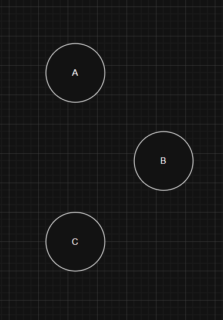
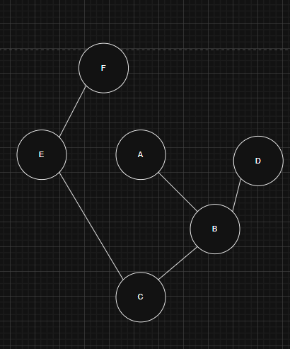

# PathFinder A*
 
___
This is a project to build a system to find a path between point A and point B in the fastest way possible

___
## Project Tree 🌳
___
````
C:.
│   Astar.cpp
│   CMakeLists.txt
│   main.cpp
│   README.md
│
└───Objects
        Edge.cpp
        Edge.h
        Map.cpp
        Map.h
        Node.cpp
        Node.h
````
___
## [How Does A* Work](https://en.wikipedia.org/wiki/A*_search_algorithm)
___

***f(n)=g(n)+h(n)*** is the function of this algorithm where *g(n)* is the cost of the path from the start node to *n* and *h(n)* is a heuristic function that estimates the cost of the cheapest path from *n* to the goal
___
## Function Edge
___git 


The edge is the way to determine that two points are connected, the edge mark the distance, is essential to know which of the points are connected to then find a path to follow 
___
## Function Node


The nodes are like the cities between the roads *(edges)*, you start in one city, and you need to reach your city goal.
___
## Function Map


Imagine you are in city **A** and you want to reach city **F**, you need to know how to get there, like a map, the map is in charge of connecting the city and the roads so you can know which path to take 